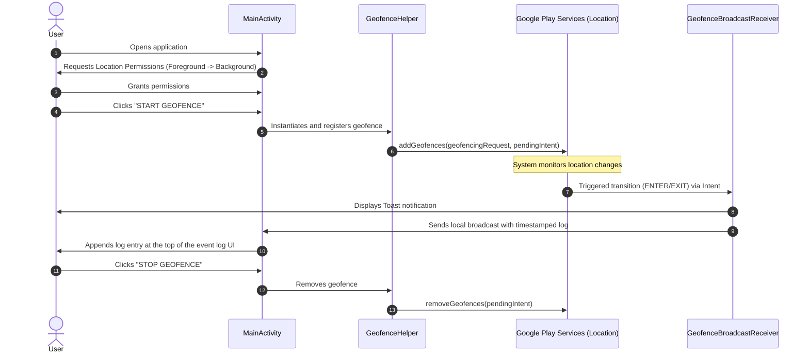

# GeoFenceAlert

## Overview

GeoFenceAlert is an Android application developed in Kotlin that demonstrates location-based services by establishing a circular geofence around a fixed coordinate. The application monitors the device location and detects when the device transitions into (ENTER) or out of (EXIT) the defined geofence boundary, notifying the user and logging timestamped events in real-time.

## Features

- **Location Permission Handling**: Requests and validates location permissions dynamically, supporting Android 10+ background location permissions (requests foreground and background permissions sequentially).
- **Geofence Registration**: Enables registration of a custom geofence with Google Play Services Location API.
- **Geofence Removal**: Supports removal/deactivation of registered geofences.
- **ENTER Transition Detection**: Captures `Geofence.GEOFENCE_TRANSITION_ENTER` transitions.
- **EXIT Transition Detection**: Captures `Geofence.GEOFENCE_TRANSITION_EXIT` transitions.
- **Toast Notifications**: Displays user-friendly Toast alerts on state transitions.
- **Timestamped Event Logging**: Logs transition events (e.g., `[HH:mm:ss] Entered Geofence!`) and displays them in a scrollable status/event log area on the UI.
- **Active Geofence Information Display**: Displays active geofence details (latitude, longitude, and radius) in the main interface.
- **Emulator Mock-Location Testing**: Configured for testing transition behavior using mock locations.

## Technology Stack

The project configuration details extracted from the Version Catalog (`gradle/libs.versions.toml`) and build scripts are:

- **Kotlin JVM Target**: JVM 17
- **Android SDK Versions**:
  - `compileSdk`: 37
  - `minSdk`: 26
  - `targetSdk`: 37
- **Gradle & Tools**:
  - Android Gradle Plugin (AGP): `9.2.1`
- **Core Dependencies**:
  - Google Play Services Location: `21.4.0` (for geofencing functionality)
  - AndroidX Core KTX: `1.19.0`
  - AndroidX AppCompat: `1.8.0`
  - AndroidX Activity KTX: `1.13.0`
  - Material Design Components: `1.14.0`
  - ConstraintLayout: `2.2.2`

## Geofence Configuration

The application defines geofence parameters as constants inside `GeofenceHelper.kt`:

| Parameter | Configured Value |
| :--- | :--- |
| **Latitude (`LAT`)** | `6.9271` |
| **Longitude (`LNG`)** | `79.8612` |
| **Radius (`RADIUS`)** | `100 meters` |
| **Geofence ID (`GEO_ID`)** | `"MY_GEOFENCE"` |
| **Expiration** | `Geofence.NEVER_EXPIRE` |

## Project Structure

The project follows the standard Android package structure below:

```
app/
├── src/
│   └── main/
│       ├── java/
│       │   └── com/example/geofencealert/
│       │       ├── MainActivity.kt               # Dynamic permission flow, UI wiring, and local event listener
│       │       ├── GeofenceHelper.kt             # Geofence building, registration, and removal logic
│       │       └── GeofenceBroadcastReceiver.kt  # Intent transition parser, notifications, and local broadcasting
│       ├── res/
│       │   └── layout/
│       │       └── activity_main.xml             # Main layout displaying geofence parameters, control buttons, and log
│       └── AndroidManifest.xml                   # Application configurations, permissions, and broadcast receiver declaration
└── build.gradle.kts                              # Module build configurations
```

## How It Works



1. **User opens the application.**
2. **Application requests required location permissions**: Prompts foreground permissions first, then background permission sequentially.
3. **User activates the geofence** by clicking the "🚀 START GEOFENCE" button.
4. **GeofenceHelper registers the geofence** with Google Play Services Location API.
5. **Android monitors the configured area** in the background.
6. **GeofenceBroadcastReceiver receives transition events** via broadcast PendingIntent when the device enters/exits the area.
7. **ENTER/EXIT transitions are detected**.
8. **Toast notification is shown** ("Entered Geofence!" or "Exited Geofence!").
9. **Event is logged with a timestamp** (`[HH:mm:ss]`) in the scrollable log area of the main screen.
10. **User can remove/deactivate the geofence** by clicking the "🛑 STOP GEOFENCE" button.

## Permissions

The app uses the following permissions declared in [AndroidManifest.xml](file:///c:/Users/Pavithira/AndroidStudioProjects/GeoFenceAlert/app/src/main/AndroidManifest.xml):

- `android.permission.ACCESS_FINE_LOCATION`: Required for high-accuracy GPS tracking.
- `android.permission.ACCESS_COARSE_LOCATION`: Required for network-based location tracking.
- `android.permission.ACCESS_BACKGROUND_LOCATION`: Required for background geofence monitoring (Android 10 / API Level 29 and higher).

### Runtime Permission Flow
- The application checks if foreground permissions (`ACCESS_FINE_LOCATION` and `ACCESS_COARSE_LOCATION`) are granted.
- If not, they are requested.
- Once foreground permissions are granted, if the device runs on API 29+, the app requests background location permission (`ACCESS_BACKGROUND_LOCATION`) separately to comply with modern Android security policies.

## Running the Project

1. **Clone the repository** to your local machine.
2. **Open the project in Android Studio**.
3. **Allow Gradle synchronization to complete**.
4. **Connect an Android device** (with Developer Options and USB Debugging enabled) or **create/start an Android Emulator**.
5. **Run the application** (Shift + F10 or Run button).
6. **Grant the location permissions** when prompted (select "Allow all the time" to allow background geofencing).
7. **Activate the geofence** by clicking "🚀 START GEOFENCE".
8. **Test the geofence behavior** by mocking location transitions.

## Testing with Android Emulator

Use the following sequence to test the application transitions manually:

1. Open the Android Emulator and click the **three dots (...)** to open the **Extended Controls**.
2. Select the **Location** tab.
3. Set a location **OUTSIDE** the geofence radius (e.g., Latitude `6.9000`, Longitude `79.8000`) and click **Send**.
4. Move **INSIDE** the geofence radius by setting the location coordinates to Latitude `6.9271`, Longitude `79.8612` and click **Send**.
5. **Verify**:
   - The Toast message `"Entered Geofence!"` is shown.
   - The screen logs a new entry like `[HH:mm:ss] Entered Geofence!`.
6. Move **OUTSIDE** the geofence area again (e.g., Latitude `6.9000`, Longitude `79.8000`) and click **Send**.
7. **Verify**:
   - The Toast message `"Exited Geofence!"` is shown.
   - The screen logs a new entry like `[HH:mm:ss] Exited Geofence!`.

## Demo Flow

For presentations or demonstrations, follow this sequence:

1. **Show the application UI**: Point out the controls, state message, and empty event log.
2. **Explain the geofence information**: Reference the displayed coordinates (Latitude: `6.9271`, Longitude: `79.8612`, Radius: `100 meters`).
3. **Show the emulator location OUTSIDE**: Display Extended Controls alongside the emulator screen.
4. **Move INSIDE**: Show the coordinates update and highlight the **Entered Geofence!** Toast and timestamped log entry.
5. **Move OUTSIDE**: Show coordinates update and highlight the **Exited Geofence!** Toast and timestamped log entry.
6. **Show the event log**: Demonstrate how the history of transitions is collected in chronological order.

## Team Contributions

### Member A — Permissions & Setup Lead
- Project setup
- Manifest structure & definitions
- Gradle configuration & updates
- User Interface (UI) layout design
- Location permissions runtime flow
- Active geofence parameters display

### Member B — Geofence Logic Lead
- Geofence constants definition
- Geofence object instantiation
- GeofencingRequest builder configuration
- PendingIntent configuration (Mutable & Update Current flags)
- Geofence registration logic
- Geofence removal/cleanup logic

### Member C — Transition Handler & Demo Lead
- GeofenceBroadcastReceiver implementation
- GeofencingEvent extraction & validation
- ENTER/EXIT transition routing
- Toast notification triggers
- Timestamped event logging & local broadcasts
- Emulator mock-location testing
- Demo preparation & validation

## Git Workflow

The project follows a standard branching workflow:

```
main
  ↑
 dev
  ↑
 ├── member-a-setup
 ├── member-b-geofence
 └── member-c-receiver
```

- **Feature/Member Branches** (`member-a-setup`, `member-b-geofence`, `member-c-receiver`): Team members work on isolated features.
- **dev Branch**: Integration branch where individual features are merged and resolved.
- **main Branch**: Production-ready stable branch representing release milestones.

## Build

- **Gradle Build Status**: Compiled and built successfully.
- **Gradle Version**: 9.4.1 / AGP 9.2.1
- **Target Java Version**: Java 17 (via Toolchain / JvmTarget 17)

## Current Testing Status

- **Build**: `PASS`
- **C6 Emulator Test**: `PENDING` (Testing instructions are prepared, but mock-location testing has not been run or logged yet in this setup).
- **C7 Demo Preparation**: `PENDING` (Demo flow is designed and ready for the presentation stage).

## Future Improvements

- **Database Persistence**: Store event logs in a SQLite/Room database so they persist when the application is closed or restarted.
- **Interactive Map Integration**: Embed a Google Map/MapView on the screen showing the geofence circle and the user's current live location marker.
- **Custom Geofence Coordinates**: Allow users to type custom coordinates and radius values directly into the app to set dynamic geofences.
- **Custom Alarm Notifications**: Introduce high-priority notification channels with custom alarm sound alerts for transition events.
